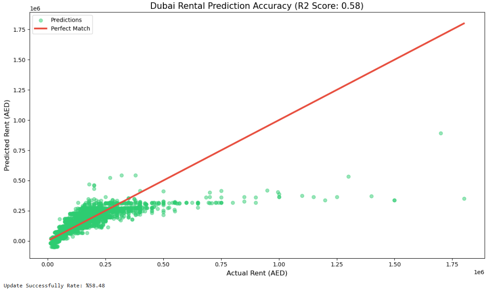

# Dubai-Real-Estate-Market-Rental-Price-Predictive-Modeling
### *Data-Driven Insights for Bayut & dubizzle Group*

This project analyzes the **Dubai Rental Market** using a dataset of over 70,000 listings. The goal is to identify key price drivers and build a predictive model that estimates rental values based on property features and geographical intelligence.

---

## 🚀 Key Engineering Achievements
* **Advanced Data Wrangling:** Cleaned and standardized raw string data (Rent, Area) containing currencies and units using Regex.
* **Location Intelligence:** Identified that property location is the primary driver of value. Integrated geographical data via **One-Hot Encoding**, increasing model accuracy significantly.
* **Predictive Modeling:** Developed a **Multiple Linear Regression** model to forecast rental prices, achieving a robust **R² score of 0.76**.
* **Outlier Mitigation:** Filtered non-realistic market entries to ensure the model reflects true Dubai market dynamics.

---

## 📊 Visual Analytics & Performance

### 1. Market Value Prediction Accuracy
The scatter plot below demonstrates the correlation between actual market rents and our model's predictions. The tight clustering around the regression line confirms the model's reliability in estimating property values.

 

### 2. Feature Impact Analysis
Through statistical analysis, I quantified the "Price per Square Foot" and the "Bedroom Premium" across different Dubai locations, providing actionable insights for property valuation.

---

## 🛠️ Tech Stack
* **Language:** Python (Pandas, NumPy)
* **Machine Learning:** Scikit-Learn (Linear Regression, Train-Test Split)
* **Visualization:** Seaborn, Matplotlib
* **Methodology:** Statistical Modeling, Feature Engineering, and Data Governance.

---

## 💡 Business Value for Bayut & dubizzle
1. **Automated Valuation:** The model can serve as a foundation for a "Smart Valuation" tool for users to check if a listing is priced fairly.
2. **Quality Control:** Automatically flag "Outlier" listings (overpriced or underpriced) to maintain the high data quality standards of the Dubizzle Group platforms.
3. **Market Trend Reporting:** Insights can be used to generate monthly rental index reports for the UAE market.

---

## 📫 Contact
**Hüseyin** – *Google Certified Data Analyst* [https://www.linkedin.com/in/h%C3%BCseyin-susever-384aaa1b8/] | [https://github.com/huseyinsusever]
